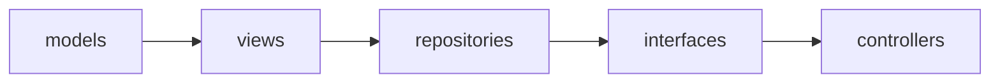
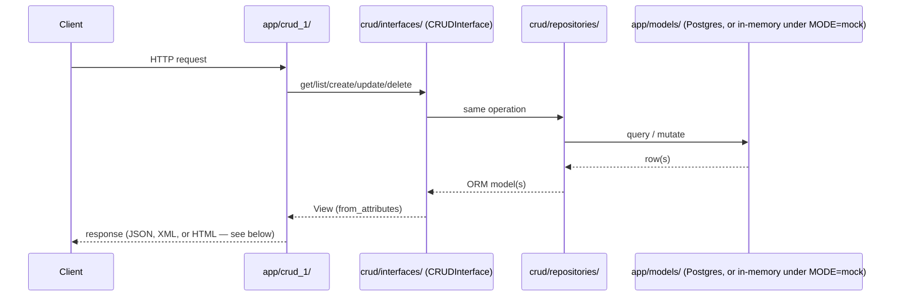

# System design

Application-level view of `src/app/` and `src/crud/`: layering, request
flow, the multi-format representation pattern, and auth. For the
infrastructure/deployment view (services, networking, healthchecks), see
[architecture.md](architecture.md). This is a summary that must stay
consistent with [src/app/README.md](../src/app/README.md)'s and
[src/crud/README.md](../src/crud/README.md)'s own "Layering" sections
and diagrams, which remain authoritative for the exact import order.

## Layering

The generic CRUD framework lives in `src/crud/`, laid out as its own
MVC-ish split under one strict, one-directional import order — a lower
layer never imports from a higher one, enforced by `import-linter`'s
`"crud layers"` contract in CI (see
[docs/adrs/0001](adrs/0001-mvc-layering-with-a-generic-crud-interface.md)):

- `models/` — the generic SQLAlchemy declarative base, record-lifecycle
  mixins, and shared revision model.
- `views/` — the generic Pydantic view base, converting to/from the ORM
  model purely through `from_attributes` (`ORMView`), plus bulk/revision/
  stats response shapes.
- `repositories/` — a storage-agnostic `Repository` protocol
  (`SQLAlchemyRepository` in `dev`/`production`, `InMemoryRepository`
  under `MODE=mock`).
- `interfaces/` — `CRUDInterface`, generic over a view and a repository;
  adding a resource needs only a model, a view, and a controller, never
  new CRUD code.
- `controllers/` — the generic CRUD router factories, the highest layer
  in this package, may import from any other `crud/` subpackage.

`src/app/` is laid out the same MVC-ish way, but holds only
resource-specific code (a resource's own model/views/router) plus
supporting layers, under its own separate `"app layers"` import-linter
contract:

- `models/` — a resource's own SQLAlchemy model (e.g. `hero.py`), built
  on `crud.models`.
- `views/` — a resource's own Pydantic schemas, built on `crud.views`.
- `controllers/` — FastAPI routers with no resource of their own
  (audit/mock).
- `crud_1/` — one subpackage per resource, combining its router (built
  from `crud.controllers`'s factories) into the single router `main.py`
  mounts.

The generic health check framework (interface, registry, and router
factory backing `/health/live`/`/health/ready`) lives in its own
sibling `src/health/` package, laid out the same MVC-ish way under its
own `"health layers"` contract — no external dependency beyond FastAPI
itself. `app/health_checks.py`'s concrete, service-specific checks
(Postgres, Redis, S3, OIDC) build on that interface and wire into a
registry `main.py` passes to `health.router.build_health_router` the
same way it uses `crud_1`'s finished router — see
[src/health/README.md](../src/health/README.md) and
[src/app/README.md](../src/app/README.md).

`config.py`/`telemetry.py`/`problem_details.py`/`oidc.py`/
`http_headers.py`/`xml_codec.py`/`web_components.py`/`health_checks.py`/
`main.py` stay flat,
outside any subpackage. See
[src/app/README.md](../src/app/README.md) for what each one does, and
[src/crud/README.md](../src/crud/README.md)'s own "Layering" section for
why `crud.controllers` importing back from `app`'s lowest flat modules
doesn't create a cycle between the two packages.

## Request flow

A resource's CRUD routes are one declarative call each
(`build_json_router`/`build_xml_router`/`build_web_router` in
`crud/controllers/crud_router.py`), sharing the same underlying
`CRUDInterface`/`CRUDLike` dependency regardless of format:

See [src/app/README.md](../src/app/README.md)'s "Example CRUD resource:
Hero" for the same flow worked through a concrete resource.

## Multi-format sibling routers

A resource's XML and HTML/web-form representations are exposed as
sibling routes (`/heroes`, `/heroes/xml`, `/heroes/form`) built by
dedicated router factories, rather than by content negotiation inside
one route — each format shares the same `CRUDLike` dependency, so none
can drift in what data it exposes or what validation it applies. See
[docs/adrs/0005](adrs/0005-multi-format-representations-via-sibling-routers.md)
and [src/crud/controllers/README.md](../src/crud/controllers/README.md)'s
"Multi-format CRUD"/"Generic CRUD router factories" sections for the
mechanics.

## Auth

Routes opt into auth with `Depends(get_current_claims)`
(`oidc.py`); a route with no such dependency is public. Authorization
(`require_roles(...)`) is enforced server-side, per backend, reading
Keycloak's `resource_access.<client>.roles` claim — never delegated to
a frontend, which can only ever hide UI as a convenience. See
[docs/adrs/0003](adrs/0003-auth-strategy-and-federated-backends.md).

`Settings.mode` (`MODE`: `dev`/`mock`/`production`) drives every
infrastructure fake from one setting instead of per-subsystem toggles:
`MODE=mock` swaps in `InMemoryRepository`, `MockHealthCheck`, and
claims-trusting auth (plus a `POST /mock/token` route), so the full
controller/CRUD stack runs with zero containers. See
[docs/adrs/0006](adrs/0006-mode-driven-fakes-for-infrastructure-free-testing.md)
and [src/app/README.md](../src/app/README.md)'s "MODE (dev / mock /
production)" section.

## Do

- Base any change to this document on
  [src/README.md](../src/README.md)/
  [src/app/README.md](../src/app/README.md)/
  [src/crud/README.md](../src/crud/README.md) and their subpackage
  `README.md`s — those stay authoritative for exact layering and
  mechanics; this document is the higher-level summary.
- Link to the relevant ADR in [docs/adrs/](adrs/) instead of restating
  its reasoning here.

## Don't

- Duplicate a subpackage `README.md`'s implementation detail here —
  summarize and link instead.
