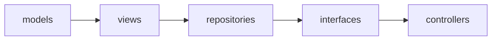

# crud/

The generic CRUD framework `app`'s resource packages (e.g. `app.crud_1.
heroes`) build on — router factories, the CRUD interface, storage-agnostic
repositories, and model/view bases — laid out as the same MVC-ish split
as `app/`, each subpackage with its own `README.md`:

- `models/` — the generic SQLAlchemy declarative base, record-lifecycle
  mixins, and shared revision model.
- `views/` — the generic Pydantic view base and bulk/revision/stats
  response shapes.
- `interfaces/` — the generic CRUD interface, built from a view + a
  repository.
- `repositories/` — storage-agnostic CRUD access, backing `interfaces/`.
- `controllers/` — the generic CRUD router factories.

None of these carry resource-specific code — a resource's own model
(`app.models.hero`), views (`app.views.hero_v1`/`hero_v2`), and router
(`app.crud_1.heroes`) live in `app/` instead and import from here to
build on this framework; see `../app/README.md`'s "Example CRUD
resource: Hero".

## Layering

Import order within `crud/` is strict and one-directional — lower
layers never import from higher ones (`models` → `views` →
`repositories` → `interfaces` → `controllers`) — enforced by
`import-linter`'s `"crud layers"` contract in `../../pyproject.toml`'s
`[tool.importlinter]`, run via `uv run lint-imports` (wired into
`../../.pre-commit-config.yaml`'s manual/pre-push stage, same as mypy).
This contract covers only ordering *within* `crud/` itself; `app/` has
its own separate `"app layers"` contract, documented in `../app/
README.md`'s own "Layering" section. `interfaces/base.py` imports
`aiomqtt` directly (`MQTTEventSink`/`MQTTEventSource`, see `../app/
README.md`'s "Example CRUD resource: Hero") — a third-party dependency,
not another `crud/` module, so it doesn't change this layer order.

`controllers/crud_router.py` also imports several of `app/`'s own flat
modules (`app.config`, `app.rate_limit`, `app.web_components`,
`app.xml_codec`) — those sit below every resource-specific `app/`
module in `app/`'s own layering (see `../app/README.md`'s "Layering"),
so this doesn't create an import cycle between the two packages: `app`'s
resource-specific modules import from `crud`, and `crud.controllers`
imports back only from `app`'s lowest, resource-agnostic flat modules,
never from `app.models`/`app.views`/`app.crud_1` or anything built on
top of them.

An arrow means "may import from" — each module may depend on anything
to its left, never anything to its right.

## Do

- Add a new generic, resource-agnostic CRUD capability here (a new
  router factory option, repository method, or view shape usable by any
  future resource) — see each subpackage's own `README.md` for where it
  belongs.

## Don't

- Add resource-specific code anywhere in this package — a resource's
  own model/view/router belongs in `app/` instead, built on top of the
  generic pieces here.
- Import from `app.models`, `app.views`, `app.crud_1`,
  `app.health_checks`, or any other resource-specific `app/` module —
  see "Layering" above.
